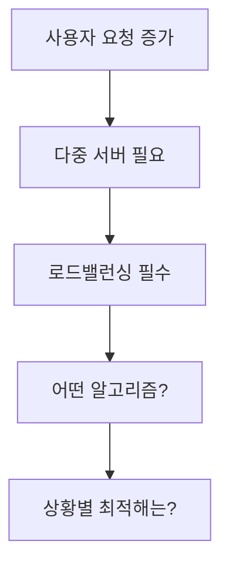

# 🚀 머신러닝 기반 지능형 로드밸런싱 시스템

<div align="center">


**Development of ML-based Intelligent Load Balancing System & Multi-Algorithm Performance Comparison**

🔬 **연구 기간**: 2025.06 ~ 2025.08 | 📊 **21가지 실험 시나리오** | 🤖 **7개 알고리즘 비교**

**관련 velog**: https://velog.io/@occasio/loadbalancing1

</div>

---

## 📋 목차

- [🎯 프로젝트 개요]
- [🏗️ 시스템 아키텍처]
- [⚙️ 알고리즘 비교]
- [🧪 실험 설계]
- [📈 진행 상황]
- [🚀 시작하기]

---

## 🎯 프로젝트 개요

> **"어떤 로드밸런싱 알고리즘이 우리 상황에 가장 적합할까?"**
> 
> 이 질문에 데이터 기반으로 답하는 연구 프로젝트입니다.

## 🔍 연구 배경

### 💭 문제 인식

현대 웹 서비스는 **동시 접속자 수 증가**와 **다양한 트래픽 패턴**에 대응하기 위해 다중 서버 환경을 채택하고 있습니다.



### 🎯 연구 목적

| 목적 | 설명 | 기대 효과 |
|:----:|:----:|:---------:|
| 🔬 **체계적 분석** | 6가지 기존 알고리즘의 특성 분석 | 알고리즘별 장단점 명확화 |
| 📊 **성능 비교** | 3가지 시나리오별 객관적 측정 | 상황별 최적 선택 기준 제시 |
| 🤖 **ML 최적화** | 지능형 로드밸런서 개발 | 동적 환경 적응력 향상 |

---

## 시스템 아키텍처

### 전체 구조

```
사용자 요청
     ↓
Spring Boot 로드밸런서 (:8080)
     ↓ 요청 분산
┌─────────────────────────────────────────────┐
│ Docker 서버 클러스터                        │
│ [서버1:5001] [서버2:5002] [서버3:5003] [서버4:5004] │
└─────────────────────────────────────────────┘
     ↑
Python Flask ML API (:9000)
```

### 기술 스택

| 영역 | 기술 | 역할 |
|:----:|:----:|:----:|
| **Backend** | Spring Boot 3.2 + Java 17 | 메인 로드밸런서 |
| **컨테이너** | Docker + Docker Compose | 4개 웹서버 환경 |
| **ML Engine** | Python Flask + scikit-learn | 예측 모델 API |
| **모니터링** | Spring Actuator + 커스텀 메트릭 | 실시간 성능 추적 |
| **테스트** | K6 | 부하 테스트 |

---

## 알고리즘 비교

### 비교 대상 (7가지)

| # | 알고리즘 | 특징 | 장점 | 단점 |
|:-:|:--------:|:----:|:----:|:----:|
| 1 | **Round Robin** | 순차적 선택 | 단순함, 공평한 분산 | 서버 성능 차이 무시 |
| 2 | **Weighted RR** | 가중치 기반 | 서버 스펙 반영 | 정적 가중치 한계 |
| 3 | **Least Connections** | 연결 수 기반 | 실시간 부하 반영 | 연결수 ≠ 실제 부하 |
| 4 | **Consistent Hashing** | 해시 링 방식 | 세션 지속성 | 분산 불균등 위험 |
| 5 | **IP Hash** | 클라이언트 IP 기반 | 캐시 친화적 | IP 분포 편향 |
| 6 | **Least Response Time** | 응답시간 기반 | 성능 최적화 | 측정 오버헤드 |
| 7 | **ML Predictive** | 머신러닝 예측 | 동적 적응 | 구현 복잡성 |

### 혁신 포인트: Temporal IP Hash

기존 IP Hash의 한계를 **시간 차원**으로 해결하는 새로운 접근법!

```java
// 기존: hash(IP) % servers
// 문제: 특정 IP 대역 편중

// 새로운 방식: hash(IP + timeWindow) % servers  
// 해결: 시간별 자동 재분산
```

---

## 실험 설계

### 테스트 시나리오

| 시나리오 | 설명 | 측정 지표 |
|:--------:|:----:|:---------:|
| **정상 트래픽** | 초당 10-20 요청 | 응답시간, 처리량 |
| **과부하 상황** | 초당 100+ 요청 | 에러율, 복구시간 |
| **서버 장애** | 1개 서버 다운 | 장애 대응, 재분산 |

### 핵심 지표

```
성능 지표
├── 응답시간 (평균/95th/최대)
├── 처리량 (RPS)
├── 에러율 (타임아웃/5xx)
├── 분산 균등성
├── 세션 지속성 (Consistent Hash)
└── 예측 정확도 (ML 모델)
```

### 실험 규모

**4개 서버 × 7개 알고리즘 × 3개 시나리오 = 21회 테스트**

---

## 진행 상황

### 완료된 작업

- [x] **연구 계획 수립** - 목적, 방법론, 평가지표 정의
- [x] **이론 연구** - 로드밸런싱 개념 및 알고리즘 분석
- [x] **Docker 환경 구축** - 4개 서버 클러스터 완성
- [x] **알고리즘 설계** - 6가지 기존 + 1가지 혁신 알고리즘
- [x] **Spring Boot 구현** - 로드밸런서 코어 로직

### 진행 중인 작업

- [ ] **성능 테스트** - 21가지 시나리오 실험
- [ ] **ML 모델 개발** - Flask API 및 예측 알고리즘
- [ ] **결과 분석** - 데이터 수집 및 성과 평가
